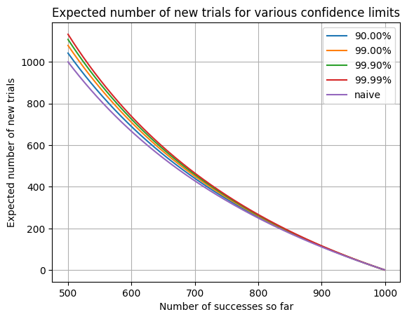

# Pre and post-selection epic plan

## Requirements

An excellent overview of the pre-selection and post-selection feature can be found
[in confluence here](https://oxfordquantumcircuits.atlassian.net/wiki/spaces/CAR/pages/3095134209/Post-selection+in+the+Compiler).
The requirements below have been gathered from this and discussions with the team and stakeholders. The requirements are
categorized into post-selection and pre-selection features, and are prioritized using the MoSCoW method (Must, Should,
Could, Would). Dependencies between requirements are also noted.

| ID       | Description                                                                                                   | MoSCoW | Dependencies                                                | JIRA Ticket(s)                                                                                                                                                                                                                                          |
| -------- | ------------------------------------------------------------------------------------------------------------- | ------ | ----------------------------------------------------------- | ------------------------------------------------------------------------------------------------------------------------------------------------------------------------------------------------------------------------------------------------------- |
| POST-1   | Post selection done for you over N shots requested (i.e. throw away bad results)                          | Must   | POST-3                                                      | [COMPILER-993](https://oxfordquantumcircuits.atlassian.net/browse/COMPILER-993)                                                                                                                                                                         |
| POST-2   | Repeat post-selection until N shots are achieved                                                              | Could  | POST-1, possibly needs structured IR                        | TBD                                                                                                                                                                                                                                                     |
| POST-3   | No post selection (i.e. as is)                                                                                | Must   |                                                             | [COMPILER-992](https://oxfordquantumcircuits.atlassian.net/browse/COMPILER-992)                                                                                                                                                                         |
| POST-4   | No post selection but return 3-state readout (i.e. Perform and record the post-selection mesurement only) | Could  | POST-1, Needs dimons to produce 3-state outputs             | TBD                                                                                                                                                                                                                                                     |
| POST-5   | Any of the above, but return the raw readout state on the IQ plane.                                           | Could  | POST-1                                                      | TBD                                                                                                                                                                                                                                                     |
| POST-6   | PuRR builder support.                                                                                         | Should | POST-1                                                      | [COMPILER-998](https://oxfordquantumcircuits.atlassian.net/browse/COMPILER-998)                                                                                                                                                                         |
| PRE-1    | Preselection on for all qubits                                                                                | Must   | POST-1, PRE-3                                               | [COMPILER-994](https://oxfordquantumcircuits.atlassian.net/browse/COMPILER-994) [COMPILER-996](https://oxfordquantumcircuits.atlassian.net/browse/COMPILER-996) [COMPILER-997](https://oxfordquantumcircuits.atlassian.net/browse/COMPILER-997) |
| PRE-2    | Preselection on for some specified qubits                                                                     | Should | POST-1, PRE-3                                               | TBD                                                                                                                                                                                                                                                     |
| PRE-3    | Preselection off                                                                                              | Must   | POST-3                                                      | [COMPILER-996](https://oxfordquantumcircuits.atlassian.net/browse/COMPILER-996)                                                                                                                                                                         |
| ACTIVE-1 | Active reset and retry for pre-selection.                                                                     | Would  | PRE-1, PRE-2, PRE-3 Needs h/w support and structured IR |                                                                                                                                                                                                                                                         |

There is a pre-existing epic for this work in
[COMPILER-98](https://oxfordquantumcircuits.atlassian.net/browse/COMPILER-98), with individual JIRA tickets which map to
each requirement as outlined in the implementation overview section.

## Implementation Order

Based on the updated MoSCoW prioritization and dependencies, we will implement the features in the following order:

1. Post-selection version 1 (MVP):
   - POST-3: No post selection (i.e. as is) [Must]
     ([COMPILER-992](https://oxfordquantumcircuits.atlassian.net/browse/COMPILER-992))
   - POST-1: Post selection done for you over N shots requested (i.e. throw away bad results) [Must]
     ([COMPILER-993](https://oxfordquantumcircuits.atlassian.net/browse/COMPILER-993))
1. Pre-selection version 1 (MVP):
   - PRE-3: Preselection off [Must] ([COMPILER-996](https://oxfordquantumcircuits.atlassian.net/browse/COMPILER-996))
   - PRE-1: Preselection on for all qubits [Must]
     ([COMPILER-994](https://oxfordquantumcircuits.atlassian.net/browse/COMPILER-994),
     [COMPILER-996](https://oxfordquantumcircuits.atlassian.net/browse/COMPILER-996),
     [COMPILER-997](https://oxfordquantumcircuits.atlassian.net/browse/COMPILER-997))
1. Post-selection version 2:
   - POST-6: PuRR builder support [Should]
     (COMPILER-998)[https://oxfordquantumcircuits.atlassian.net/browse/COMPILER-998] (TBD, but will likely require
     updates to the PuRR builder to support the new frontend DSL for pre/post-selection configuration)
1. Pre-selection version 2:
   - PRE-2: Preselection on for some specified qubits [Should] (New JIRA ticket required)
1. Post-selection version 3:
   - POST-2: Repeat post-selection until N shots are achieved [Could] (New JIRA ticket required)
   - POST-4: No post selection but return 3-state readout (i.e. Perform and record the post-selection measurement only)
     [Could] (New JIRA ticket required)
   - POST-5: Any of the above, but return IQ pairs describing the raw readout state on the IQ plane [Could] (New JIRA
     ticket required)
1. Active-reset
   - ACTIVE-4: Active reset and retry for pre-selection (after PRE-1, PRE-2, PRE-3, and hardware/IR support) [Would]

## Implementation overview

The Qat compiler and runtime post-processing will need to be modified to support the generation of the relevant IR
instructions for pre-and post-selection. This section outlines the high-level implementation plan for each requirement
above and refers to existing JIRA tickets that relate to the implementation of each requirement. (e.g.
[COMPILER-992](https://oxfordquantumcircuits.atlassian.net/browse/COMPILER-992) for POST-3).

While we currently deal with only 2-state measurements, in the future we will need to extend this to support multi-state
measurements for post-selection and pre-selection (e.g. for dimons). States map to regions in the measurement plane, so
the simplistic mapping of IQ pairs to binary outcomes by projecting onto a single real value is not sufficient: the
post-processing logic will need to be updated accordingly.

NOTE: Only Qat will be modified to support these feature. Purr is a legacy compiler and will not be modified to support
it.

### POST-3: No post selection (i.e. as is)

This is effectively a preparatory step, mostly affecting configuration and ensuring the IR and runtime can support the
new post-processing type without doing anything with it.

Implement a new measurement post-process type `POST_SELECT` in the `PostProcessType` enumeration, used by the
PostProcessing instruction (see `qat/ir/instruction_builder.py`). In this case this will be a no-op and ignored by the
runtime. The compiler frontends (e.g., `qat/qasm/ir_builder.py` in `build_measure`) should be updated to add the
post-selection instruction after the measurement instruction, specifying the qubit to post-select on. The
`InstructionBuilder` class may need to access the compiler config to determine when and how to build these instructions.

### POST-1: Post selection done for you over N shots requested (i.e. throw away bad results)

Update the runtime (`qat/runtime/post_processing.py`) `AcquisitionPostProcessing` pass to support the new `POST_SELECT`
post-processing type. This will apply two post-processing steps:

1. `complex_map`. This applies a matrix multiplication and translation (an affine transform) to each IQ pair in order to
   allow an arbitrary "de-distortion" of the IQ plane. This is a superset of the pre-existing
   `linear_map_complex_to_real` functionality, which is equivalent to a projection onto a single real value. This will
   allow us to easily extend to multi-state measurements in the future, where the state centres will not fall on a line
   the IQ plane. The reason for the matrix multiplication is to ensure that distance metrics in the next `demodulate`
   step are meaningful, i.e., that the distance of a sample from a state centre in the IQ plane is proportional to the
   likelihood of that sample being in that state. The parameters for the complex map (matrix and translation) will be
   specified in the harwdware model and passed to the runtime, where they will be applied to the IQ pairs before the
   demodulation step.

1. `decode`. This maps IQ pairs to state outcomes. For now, this will be defined by a simple map of states to IQ
   locations. In the simplest case, the decoder selects the state closest to the input point (an extension of the
   pre-existing threshold discriminator, which is equivalent to a two-state map).

   A more sophisticated decoder could calculate likelihoods for $|n\rangle$ from the distance metrics of the input
   symbol $r$ to the state centres $s_n$ and a noise estimate $\sigma^2$, using

   $$p(r \mid s_{|n\rangle}) \propto \exp\left(-\frac{|r - s_{|n\rangle}|^2}{\sigma^2}\right)$$

   These likelihoods can be normalised to obtain real probabilities and the decoder can then output an "unknown" state
   if the probability of the best state is below a certain threshold, or if the probability difference between the top
   two states is very small.

   Again, the location of the state centres and noise estimate will be specified in the hardware model and used by the
   runtime when executing the post-processing step.

In some scenarios, steps 1 and 2 could be represented as a single step, e.g. if a GMM is used to specify the expected
distribution of IQ pairs for each state, then the complex map is effectively "baked in" to the discrimination step, as
the likelihood of a sample being in a given state is determined by the GMM parameters. In this case, the complex map
parameters would be identities and the discrimination step would be a maximum likelihood classification based on the GMM
parameters: the pipeline is flexible enough to support both approaches.

Note that these ideas are very similar to those used in the final stages of communications-grade classical signal
processing, where the received signal is passed through a complex affine transform to correct for channel distortions,
and then classified based on distance to constellation points in the IQ plane.

The `AcquisitionPostProcessing` pass should also aggregate measurement results for the specified qubits and then filter
out results as part of the runtime execution of the `Return()`.

Finally we will need to adapt some existing live tests to check post-selection functionality.

### PRE-3: Preselection off

This is the default behavior and requires no changes to the IR or runtime. Only the compiler config needs to be updated
to allow the user to specify the pre-selection mode. Preselection should be disabled by default to avoid any unintended
consequences for existing users. At this stage, this is a global configuration. Definining pre-selection per qubit will
be reserved for PRE-2.

### PRE-1: Preselection on for all qubits

Modify the instruction builder to add a pre-selection `measure_single_shot_z()` measurement to all qubits specified by
the frontend input. Add a new PostProcessing instruction with a post-process type `PRE_SELECT` to the `PostProcessType`
enumeration (see `qat/ir/instruction_builder.py`). The runtime should be updated to filter out shots that do not match
the |0⟩ state. Pre-selection should be configurable via the compiler config and only added if enabled.

Finaly, add tests: The proposal is to create a simple 1Q or 2Q circuit which is run with a low passive reset time to
induce a non-zero failure rate, and compare results with and without pre-selection enabled, asserting that the
pre-selection results are as good or better.

### POST-2: Repeat post-selection until N shots are achieved

After aggregating results and removing failed shots (POST-1), estimate the shot failure rate and request additional
shots as needed to reach the requested total, using a beta distribution to model the success rate. The number of shots
requested can be set such that there is a high confidence of achieving the required number of successful shots, e.g., by
using the 99% confidence interval of the beta distribution and 3 passes, we can expect that we will miss the required
number of successful shots only 0.01% of the time.

See https://github.com/jlucas-oqc/playgound/blob/main/beta_bin.ipynb for an example of how to use the beta distribution
to model the success rate and estimate the number of additional shots needed.

Note that this will require changes to the runtime to support multiple passes of execution and aggregation of results
across passes, as well as changes to the configuration to allow users to specify the desired confidence of success per
pass and max number of passes.

### POST-6: PuRRBuilder Compatibility

This should be a NOOP: We envisage that in this case QEs would provide a custom config with pre/post-selection options
to configure the run-time, and that the PuRR builder would be updated to support the additions to the frontend DSL.

### PRE-2: Preselection on for some specified qubits

Extend the pre-selection configuration and pass to allow specifying a subset of qubits for pre-selection, based on the
compiler config. This will require changes to the instruction builder to add pre-selection measurements only for the
specified qubits. The runtime should be unchanged as it should already be filtering shots based on the pre-selection
measurements.

TODO: How do we specify qubits for pre-selection in the compiler config? Compiler config is a global config that is not
aware of the circuit structure or even input language, so we cannot specify qubits by name or index.

### POST-4: No post selection but return 3-state readout (i.e. Perform and record the post-selection measurement only)

Implement a mode where no post-selection is performed as normal, but an n-state readout is also returned and recorded.
This requires extending the post-processing and result reporting logic to support n-state outcomes from the decoder.
Note that we will not aggregate this readout - it would be per qubit, per shot.

### POST-5: Any of the above, but add an (i,q) pair describing the readout state on the IQ plane

Add support in the runtime post-processing for returning an (i,q) pair (or complex number) describing the readout state
on the IQ plane, in addition to the standard results, for any of the post-selection modes. Note that we will not
aggregate this readout - it would be per qubit, per shot.

### ACTIVE-1: Active reset and retry for pre-selection [Future, requires hardware support]

FFS: This is not part of the current epic plan as it requires hardware support and a more structured IR to support
active reset and retry logic.
