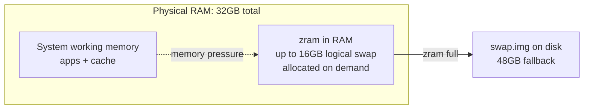

# Linux Memory Tuning for Large Test Workloads

Without tuning, Linux dev machines can suffer OOM kills, severe slowdown or desktop freezes under large memory-intensive
workloads (such as large parallel pytest suites). This guide permanently configures a machine to handle them more
gracefully.

It combines:

- `zram` — fast compressed swap in RAM
- disk swap — large fallback safety net
- kernel tuning — smoother behaviour under memory pressure

> **Note: all specific values in this guide (swap sizes, `SIZE`, sysctl ratios) are tuned for a 16GB RAM machine.** See
> [Scaling to larger memory systems](#scaling-to-larger-memory-systems) at the end for suggested values for 32GB, 48GB,
> and 64GB machines.

The configuration for a 16GB RAM machine looks like this.

Note: Mermaid cannot automatically size boxes to exact memory proportions. The diagrams below show the right
relationships and approximate capacities, but they are not to scale.


For a 32GB RAM machine, the same config pattern looks like this:



______________________________________________________________________

## Configure disk swap

Use `/swap.img` consistently in all commands and in `/etc/fstab`.

```bash
sudo swapoff /swap.img || true
sudo fallocate -l 24G /swap.img
sudo chmod 600 /swap.img
sudo mkswap /swap.img
sudo swapon /swap.img
```

Verify:

```bash
swapon --show
```

Ensure `/etc/fstab` contains:

```conf
/swap.img none swap sw 0 0
```

______________________________________________________________________

## Enable zram

Install:

```bash
sudo apt update
sudo apt install -y zram-tools
```

Edit config:

```bash
sudo nano /etc/default/zramswap
```

```conf
# zstd gives better compression at low CPU cost
ALGO=zstd

# Fixed logical swap cap — not pre-allocated, only used under pressure
SIZE=12288

# Prefer zram over disk swap (higher number = higher priority)
PRIORITY=100
```

Apply:

```bash
sudo swapoff -a
sudo systemctl restart zramswap
sudo swapon -a
```

Verify zram is active and has higher priority than disk swap:

```bash
zramctl
swapon --show --output=NAME,TYPE,SIZE,USED,PRIO
```

Expected: the zram entry has a higher `PRIO` value than `/swap.img`.

______________________________________________________________________

## Kernel tuning

Create a VM tuning `sysctl` file:

```bash
sudo nano /etc/sysctl.d/99-dev-memory.conf
```

```conf
# Prefer swap moderately early — good with fast zram-backed swap.
vm.swappiness = 30

# Keep filesystem cache longer for repeated test/build cycles.
vm.vfs_cache_pressure = 50

# Reduce large writeback bursts that cause stalls.
vm.dirty_background_ratio = 5
vm.dirty_ratio = 15

# Optimistic allocation — prevents failures in large Python workloads.
vm.overcommit_memory = 1
```

Apply:

```bash
sudo sysctl --system
```

______________________________________________________________________

## Scaling to larger memory systems

The rules of thumb used in this guide:

- **zram `SIZE`**: set to a fixed absolute value rather than a percentage. ~12GB is sufficient on a 16GB machine; on
  larger systems cap at 16384 MB (~16GB). Beyond ~16GB, zram starts competing with the workload for RAM rather than
  helping it. Using `SIZE` directly is simpler and more explicit than computing a `PERCENT`.
- **Disk swap**: 1.5× physical RAM — large enough to be a real safety net without wasting too much disk.
- **`vm.swappiness`**: keep at `30` for all sizes; zram is fast enough that early swapping is acceptable.
- **`vm.dirty_background_ratio` / `vm.dirty_ratio`**: scale down slightly on larger systems where writeback bursts can
  be proportionally larger.

| Setting                     | 16 GB | 32 GB | 48 GB | 64 GB |
| --------------------------- | ----- | ----- | ----- | ----- |
| zram `SIZE` (MB)            | 12288 | 16384 | 16384 | 16384 |
| Disk swap (`/swap.img`)     | 24 GB | 48 GB | 72 GB | 96 GB |
| `vm.dirty_background_ratio` | 5     | 4     | 3     | 3     |
| `vm.dirty_ratio`            | 15    | 12    | 10    | 10    |

All other settings (`ALGO=zstd`, `PRIORITY=100`, `vm.swappiness=30`, `vm.vfs_cache_pressure=50`,
`vm.overcommit_memory=1`) remain the same regardless of RAM size.

______________________________________________________________________

## Notes

- Some swap usage is normal — do not treat swap activity as a problem
- Slightly increased CPU usage is expected from zram compression
- Tuned for **developer workloads**, not latency-critical or production systems
